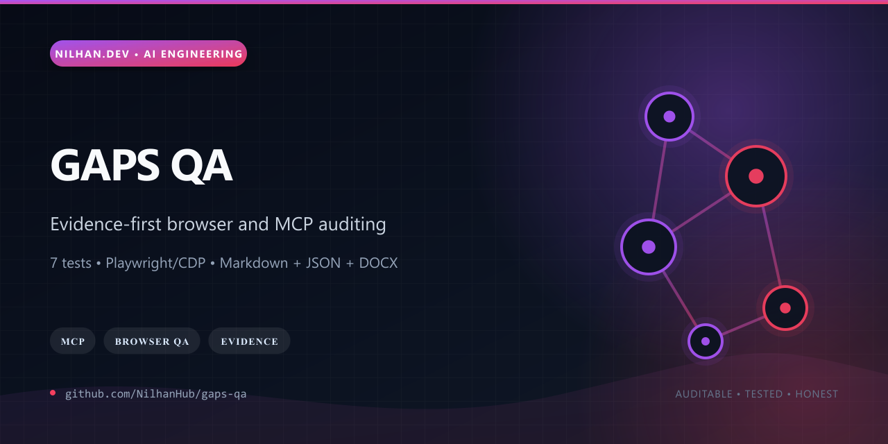
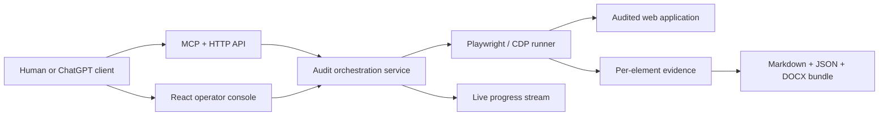

# GAPS QA

[](https://github.com/NilhanHub/gaps-qa/actions/workflows/ci.yml)
[](LICENSE)
[](https://modelcontextprotocol.io/)



GAPS QA is an evidence-first UI-auditing system that turns exploratory browser runs into durable, reviewable engineering artifacts. It combines a React operator console, a remote MCP surface, a Playwright/CDP runner, run persistence, live progress streaming, and deterministic Markdown, JSON, and DOCX reporting.

The design goal is not merely to say that a page “looks wrong.” Every completed audit can preserve per-element findings, machine-readable evidence, human-readable write-ups, and a canonical bundle that another engineer or agent can inspect independently.

## Why it stands out

- Browser automation is isolated behind a runner contract; Playwright over CDP is the active adapter.
- The Node orchestration service exposes HTTP, SSE, bundle-serving, and MCP interfaces from one canonical run model.
- Each run emits structured element evidence plus `UI_Element_Writeups.md`, `UI_Element_Writeups.docx`, and `ui-element-audit.json`.
- DOCX generation is self-contained and uses Python's standard library rather than a machine-global document package.
- Cloudflare is treated as an edge proxy while the stateful Node service remains the runtime authority.
- The release passes full TypeScript validation, **7 tests including a live browser fixture**, and both web and server builds.



## Repository map

- `shared/` — canonical schemas, report contracts, and bundle generation
- `runners/` — browser-runner adapters and Playwright/CDP implementation
- `server/` — orchestration, persistence, MCP, HTTP API, SSE, and bundle serving
- `web/` — React operator console and ChatGPT widget surface
- `policy/` — single-sourced QA operating contract
- `cloudflare/` — optional edge proxy adapter

## Quick start

```bash
npm ci
npm run check
npm test
npm run build
npm start
```

Open `http://127.0.0.1:3000/app`. Completed runs are stored under `.data/runs/<run-id>/bundle/` by default, and the MCP endpoint is `/mcp`.

## Deployment shape

`render.yaml` describes the primary stateful Node deployment. `cloudflare/worker.ts` and `wrangler.jsonc` provide an optional edge-proxy layer configured with `UPSTREAM_BASE_URL`. No deployment URL is advertised until a live smoke check has passed.

## Maturity and boundaries

GAPS QA is a substantial working prototype, not a claim of universal visual correctness. Automated evidence still needs human or agent judgment, CDP connectivity must be authorized for the target browser, and deployment operators must add authentication, rate limits, and retention controls appropriate to their environment.

See [SECURITY.md](SECURITY.md), [CONTRIBUTING.md](CONTRIBUTING.md), and [RIGHTS.md](RIGHTS.md) before exposing the service publicly.
